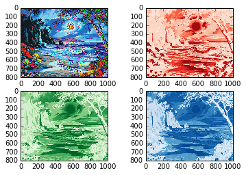

UECM3033 Assignment #2 Report
========================================================

- Prepared by: Ng Wan Ping
- Tutorial Group: T2

--------------------------------------------------------

## Task 1 --  $LU$ Factorization or SOR method

The reports, codes and supporting documents are to be uploaded to Github at: 

https://github.com/ngwanping/UECM3033_assign2

Explain your selection criteria here.

If the matrix is sparse matrix, then we use SOR method.
Sparse matrix is a matrix which the most elements are zero.
The condition i set for deciding whether use LU or SOR by comparing the number of nonzero elements in matrix A with the half of the length of matrix A.
If the nonzero element in matrix A is more than half of total elements in matrix A, it mean matrix A have large number of nonzero compared to zero.
So if the condition is true, it will perform LU factorization, else it will perform SOR method.
The number of nonzero element is counted by using numpy function,count_nonzero.
The length of A is use len.

Explain how you implement your `task1.py` here.

In self-defined fucntion named lu, decompose the LU sand solve the LU using for.
To perform SOR method, set a iteration limit as 10 and initiate omega as 1.03.
In self-defined fucntion named sor, let x be zero matrix which is same size as matrix b.

Use np.array to make the A and b to be a matrix.
astype float is used to convert to float.
Assign the variables sol=np.linalg.solve(A,b) 
Then solve the Ax=b by using LU if the condition is true ,else use SOR.
Display the sol.

---------------------------------------------------------

## Task 2 -- SVD method and image compression

Put here your picture file (seaside.jpg)

How many non zero element in $\Sigma$?
There are 800 non zero elements in Sigma for three colors.
It mean all elements in Sigma of 3 colours are non zero.

Put here your lower and better resolution pictures. Explain how you generate
these pictures from `task2.py`.

First, create a self defined function named svd. Read the "seaside.jpg" image and assiged to img.
Then, compute the U,$\Sigma$ and V for for each of the red, green and blue matrices.
Use numpy function, count_nonzero to find number of non zero elememts in $\Sigma$ for red,green and blue colours respectively.
Create a new Sigma matrix by copying the each of original $\Sigma$ and keep the first n nonzero elememts while set all other none zero elements to zero by using numpy function zeros_like.
To construct a lower resolution matrix, change the dimension of $\Sigma$ from (800,1) to (800,1000)by using spicy function linalg.diagsvd,it is because the dimension of U is (800,800) and V is (1000,1009).
In order to use dot multiplication for new matrix,so the new matrix will be U*$\Sigma$ * V which is dimension of (800,1000).
Then, create and display the new resolution images.
All the steps above are in self defined function named svd.

To compress a lower resolution picture, call the svd function with input n=30.
To compress a better resolution picture, call the svd function with input n=200.

What is a sparse matrix?
A sparse matrix is a matrix with the most of the elememts are zero, mean it has larger number of zero values compared to nonzero.
In contrast,a matrix where many elements are nonzero is called dense, as the Sigma matrix we had in task 2.

-----------------------------------

last modified: 10 Marth 2016
